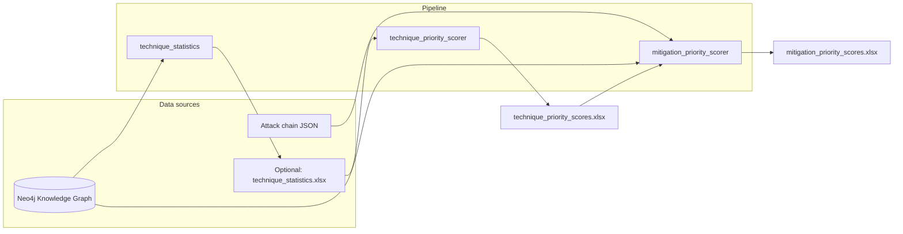

# MITRE ATT&CK for ICS — Techniques and Mitigations Prioritization Engine

A data-driven pipeline that **ranks MITRE ATT&CK for ICS techniques** by multi-criteria risk and **ranks security mitigations** for a given attack chain using a **Weighted Sum Model (WSM)** aligned with prior research on MITRE ATT&CK and multi-criteria decision-making (MCDM). The system consumes a **Neo4j knowledge graph** of ATT&CK for ICS and produces Excel workbooks for analysis and integration with detection and recommendation workflows.

---

## Table of contents

1. [Overview](#1-overview)  
2. [Objectives](#2-objectives)  
3. [Concept and design](#3-concept-and-design)  
4. [Methodology](#4-methodology)  
5. [Implementation](#5-implementation)  
6. [Usage](#6-usage)  
7. [Results and interpretation](#7-results-and-interpretation)  
8. [Integration](#8-integration)  
9. [Limitations and future work](#9-limitations-and-future-work)  
10. [Repository layout](#10-repository-layout)  
11. [License and references](#11-license-and-references)

---

## 1. Overview

### 1.1 Purpose and scope

This repository implements an **industrial control system (ICS)–focused prioritization engine** for:

- **Global technique prioritization** — scoring every technique in the ATT&CK for ICS matrix using graph-derived statistics and MCDM (entropy-weighted criteria + weighted sum).
- **Contextual mitigation prioritization** — given an **observed or hypothesized attack chain** (ordered list of techniques), ranking **mitigations** that appear in the knowledge graph and address those techniques, weighted by the same global technique priorities.

Scope is **MITRE ATT&CK for ICS** (not Enterprise-only matrices), with optional alignment to **simulation and lab scenarios** (for example, GRFICS-style attack chains) expressed only as data (JSON), not hardcoded in code.

### 1.2 Problem statement and motivation

Defenders need to decide **which techniques matter most** across the full matrix, and **which mitigations to apply first** when a specific multi-step attack is relevant. Raw MITRE data is rich in relationships (groups, software, detections, mitigations) but does not by itself produce a **single risk ordering** of techniques or a **chain-aware mitigation to-do list**.  

This engine **quantifies** technique criticality from the knowledge graph, then **reuses** those scores as weights in a **transparent MCDM layer** for mitigations, so that rankings are **repeatable, auditable**, and suitable for both **operational** use (triage) and **research** (comparison of methods or scenarios).

---

## 2. Objectives

| Goal | Description |
|------|-------------|
| **Technique prioritization** | Assign each ATT&CK for ICS technique a **priority score** and rank using **four criteria** (threat usage, control gap, mitigation “difficulty,” asset exposure), with **objective weights** from the **Entropy Weight Method (EWM)**. |
| **Mitigation prioritization** | For a user-supplied **attack chain**, compute a **WSM score** for each relevant mitigation, reflecting **how much** the mitigation addresses high-priority chain techniques and **how many** distinct chain techniques it covers. |
| **Graph fidelity** | **No hardcoded** technique or mitigation sets: counts and **MITIGATES** links come from **Neo4j** (same schema as the project’s ATT&CK for ICS knowledge graph). |
| **Reproducibility** | Configuration via **environment variables** and **`.env`**; outputs as **Excel** for inspection and downstream tools. |

---

## 3. Concept and design

### 3.1 High-level architecture



The **knowledge graph** is the system of record for **technique–mitigation** edges and per-technique **statistics**. **Technique priority scores** are produced once (or whenever the graph export is refreshed) and then **reused** as **weights** for mitigation ranking on arbitrary chains.

### 3.2 Key components and roles

| Component | Role |
|-----------|------|
| **`technique_statistics.py`** | Connects to Neo4j, aggregates per-technique metrics (assets, software, groups, campaigns, mitigations, detection data components), exports **`input/technique_statistics.xlsx`** (by default). |
| **`technique_priority_scorer.py`** | Reads the statistics workbook, builds the **MCDM decision matrix**, **normalizes** columns, computes **EWM** weights, applies **WSM** to get **global technique ranks**, exports **`output/technique_priority_scores.xlsx`**. |
| **`mitigation_priority_scorer.py`** | Loads **technique priority scores**, parses an **attack chain**, queries Neo4j for **MITIGATES** relationships and per-technique **N** (mitigation count), runs **mitigation WSM**, exports **`output/mitigation_priority_scores.xlsx`**. |
| **`config.py`** | Central **non-secret** configuration: loads **`.env`**, exposes **Neo4j credentials** and **path** defaults. |
| **`utils/`** | Reusable helpers: **attack chain** parsing, **technique score** loading from Excel, **Neo4j** repository, **kg_model** (data structures), **MCDM/WSM** math for mitigations. |

### 3.3 Data flow

1. **Full matrix**  
   `Neo4j` → `technique_statistics` → `technique_priority_scorer` → **ranked techniques** (Excel).  

2. **Attack-specific mitigations**  
   **Attack chain** (JSON) + **technique_priority_scores** + `Neo4j` **MITIGATES** & counts → `mitigation_priority_scorer` → **ranked mitigations** (Excel).

The attack chain is **not** the full matrix: it is a **subset of techniques** (with possible **duplicates** to stress repeat stages). Duplicate instances **scale** the raw weight of that technique before renormalization.

---

## 4. Methodology

### 4.1 Technique scoring (MCDM + EWM + WSM)

For each technique *i*, four **benefit** criteria are computed from statistics (summary):

| Criterion | Meaning (intuition) |
|-----------|----------------------|
| **C1 – Impact** | Inversely related to the **number of mitigations** in the graph (fewer listed mitigations → higher raw score, interpreted as “harder to fully mitigate” in this framing). |
| **C2 – Threat score** | Log-sums of **groups**, **campaigns**, and **software** using the technique. |
| **C3 – Security control gap** | Inversely related to the number of **data components** available for **detection**. |
| **C4 – Asset impact** | Log of the number of **targeted assets** in the graph. |

The **decision matrix** is **column-normalized** (proportional normalization). **Weights** for C1–C4 are **not** hand-tuned: they are derived by the **Entropy Weight Method (EWM)** so criteria that discriminate more between techniques receive higher weight. The **final technique score** is a **Weighted Sum (WSM)** of the normalized values, then **min–max** normalized to **[0, 1]** for interpretability (`Priority_Score_Normalized`).

### 4.2 Mitigation prioritization (chain-aware WSM)

This step follows a **criterion = technique in the chain** view (MCDM over mitigations), consistent with a **WSM** formulation in the MITRE + MCDM literature:

- For each **chain technique** *j* with a **global** mitigation count **N_j** in the full graph, any mitigation that **MITIGATES** *j* receives the same per-column value **m_ij = 1 / N_j** (splitting “credit” equally across all official mitigations for *j*).
- **Weight** **w_j** = technique’s **Priority_Score_Normalized** from the previous step, **times** the **number of times** *j* appears in the chain, then **renormalized** so active criteria sum to 1. Techniques with **N_j = 0** in the graph are **excluded** from the WSM and reported in **warnings**.

**WSM score for mitigation *i*:**

\[
S_i = \sum_{j \in \text{chain}} w_j \cdot m_{ij}
\]

**Chain coverage** is the count of **distinct** chain techniques that mitigation *i* helps address (within the current chain). Mitigations that cover **more** high-weight techniques and share **1/N** fairly rank higher, **all else being equal**.

### 4.3 Use of the MITRE ATT&CK for ICS knowledge graph

- **Schema used:** `(:Mitigation)-[:MITIGATES]->(:Technique)`; technique IDs (e.g. `T08xx`) and mitigation IDs (e.g. `M09xx`) match ATT&CK for ICS.  
- **N_j** is the **count of distinct** `Mitigation` nodes linked to technique *j* in the **entire** graph, not only mitigations that appear in a small query window. This keeps **1/N** comparable to a **framework-wide** notion of how “crowded” a technique’s mitigation set is.  
- **technique_statistics** and **mitigation** queries are consistent with the same Neo4j instance used to build the published ATT&CK for ICS graph.

---

## 5. Implementation

### 5.1 Main modules (entry points)

| Script | Responsibility |
|--------|------------------|
| **`technique_statistics.py`** | Cypher-based aggregation, Excel export, logging of a safe Neo4j endpoint label (no password in logs). |
| **`technique_priority_scorer.py`** | `TechniquePriorityScorer` class: `load_data` → `compute_criteria` → `normalize_matrix` → `compute_entropy_weights` → `compute_priority_scores` → `export_results`. |
| **`mitigation_priority_scorer.py`** | `MitigationPriorityScorer` class: loads priority table, fetches `TechniqueMitigationInfo` from `KGMitigationRepository`, calls `build_mitigation_rankings`, optional Excel export with methodology and warning sheets. |
| **`config.py`** | `load_environment()`, `get_neo4j_credentials()`, path helpers, `ConfigurationError` on misconfiguration. |

### 5.2 Project structure (conceptual)

```
.
├── config.py                    # Environment and path resolution
├── technique_statistics.py      # Step 1: graph → technique statistics
├── technique_priority_scorer.py   # Step 2: MCDM technique ranks
├── mitigation_priority_scorer.py  # Step 3: WSM mitigations for a chain
├── requirements.txt
├── .env.example                 # Documented variables (no secrets)
├── input/
│   ├── example_attack_chain.json
│   └── technique_statistics.xlsx   (produced by step 1, default path)
├── output/
│   ├── technique_priority_scores.xlsx
│   └── mitigation_priority_scores.xlsx
└── utils/
    ├── attack_chain.py          # Normalize IDs, JSON loaders, counts
    ├── technique_score_loader.py
    ├── kg_model.py              # TechniqueMitigationInfo, edges
    ├── kg_mitigation_repository.py  # Neo4j queries
    └── mcdm_mitigation_scoring.py  # WSM, weights, DataFrame export
```

### 5.3 Key algorithms (processing steps)

1. **Statistics generation**  
   For each `Technique` node, optional matches count related assets, software, campaigns, groups, mitigations, and data components.  

2. **Technique MCDM**  
   Build matrix → normalize columns → EWM on normalized columns → WSM per row → rank → **Excel** (multiple sheets: full table, top 20, methodology, summary).  

3. **Mitigation WSM**  
   Parse chain → load `Priority_Score_Normalized` per technique id → **Neo4j**: edges and **N_j** for chain techniques → compute **w_j** and **S_i** → sort → **Excel** (rankings, attack chain, weights, N per technique, warnings).

---

## 6. Usage

### 6.1 Prerequisites

- **Python 3.10+** (recommended; type hints use modern syntax)  
- **Neo4j** with the project’s **ATT&CK for ICS** graph loaded  
- **Network** access to the Neo4j instance  

Install dependencies:

```bash
cd MITRE-ATTACK-for-ICS-Techniques-and-Mitigations-Prioritization-Engine
python -m venv .venv
source .venv/bin/activate   # Windows: .venv\Scripts\activate
pip install -r requirements.txt
```

### 6.2 Configuration

1. Copy **`.env.example`** to **`.env`**.  
2. Set at least: **`NEO4J_URI`**, **`NEO4J_PASSWORD`**, and **`NEO4J_USER`** *or* **`NEO4J_USERNAME`**.  
3. Optional: override paths (see `.env.example`) — all paths may be **relative to the repository root** or **absolute**.

### 6.3 Run end-to-end

```bash
# 1) Export technique statistics from Neo4j
python technique_statistics.py

# 2) Compute global technique priority scores (MCDM)
python technique_priority_scorer.py

# 3) Rank mitigations for the example attack chain
python mitigation_priority_scorer.py
```

Run order matters: **(2)** requires **`input/technique_statistics.xlsx`** (or your configured `INPUT_TECHNIQUE_STATISTICS`); **(3)** requires **`output/technique_priority_scores.xlsx`**.

### 6.4 Example attack chain

The file **`input/example_attack_chain.json`** is a **data-only** illustration (GRFICS-style multi-stage list): stages include `technique_id` fields. You can replace it or point `INPUT_ATTACK_CHAIN_JSON` to another file with the same shape (`technique_ids` list or `stages` with `technique_id`).

**Illustrative sequence (abridged):** `T0819` → `T0846` → `T0842` → `T0812` → … → `T0831` (twice) → `T0879`. Duplicated `T0831` increases that technique’s weight before renormalization.

### 6.5 Example outputs

| Artifact | Description |
|----------|-------------|
| **`input/technique_statistics.xlsx`** | One row per technique, columns for **counts** used in C1–C4. |
| **`output/technique_priority_scores.xlsx`** | **Priority_Score_Normalized**, ranks, raw score, **EWM** weights in **Methodology** sheet. |
| **`output/mitigation_priority_scores.xlsx`** | **Mitigation Rankings** (WSM, coverage, per-technique JSON contributions), **Attack Chain**, **Criterion Weights**, **N per Technique**, **Warnings**, **Methodology**. |

---

## 7. Results and interpretation

### 7.1 Sample outputs (what to look for)

- **Technique sheet:** higher **`Priority_Score_Normalized`** means **higher** global priority under the EWM+WSM model (not a probability of attack). **Priority_Rank** 1 = highest.  
- **Mitigation sheet:** higher **`WSM Score`** = better alignment with **high-priority, chain-relevant** techniques, under the **1/N** split. **`Chain Coverage`** = how many **distinct** chain techniques the mitigation **addresses** in the graph.  
- **Warnings:** e.g. technique in the chain with **no** mitigations in Neo4j (**N=0**), or technique id **missing** from the priority workbook (imputation by **mean** / **min** / **max** / **zero** per `missing_policy` in code).  

### 7.2 Interpreting scores in research vs operations

- **Academic / comparative studies:** use **raw** and **normalized** columns together, report **EWM** weights, and state **assumptions** (e.g. C1 as inverse mitigation count).  
- **Blue-team / OT:** use rankings as a **triage** list; combine with **local** policy, **asset** inventory, and **detection** maturity rather than as a single ground truth.

---

## 8. Integration

| Partner system | Role |
|------------------|------|
| **MITRE ATT&CK for ICS Knowledge Graph (Neo4j)** | **Source of truth** for `Technique`, `Mitigation`, `MITIGATES`, and relationship counts. Must stay **version-aligned** with the Excel/statistics the team expects (e.g. v18). |
| **ICS Detection and Correlation Engine** | Can feed **observed** technique sequences (as an attack chain) into **`mitigation_priority_scorer`** or the **`utils`** API for **reactive** mitigation ordering after detection. |
| **AegisRec / recommendation layer** | Can consume **ranked techniques** and **ranked mitigations** as **inputs** to higher-level playbooks, SLAs, or human-readable reports. |
| **Simulation (e.g. Caldera/GRFICS)** | Attack chains from exercises map naturally to the **JSON** input format; no code change required, only new JSON files. |

**Programmatic** usage (pseudocode):

```python
from config import get_neo4j_credentials, load_environment
from utils.kg_mitigation_repository import KGMitigationRepository
from mitigation_priority_scorer import MitigationPriorityScorer

load_environment()
uri, user, password = get_neo4j_credentials()
repo = KGMitigationRepository(uri=uri, username=user, password=password)
# scorer = MitigationPriorityScorer(repo, "output/technique_priority_scores.xlsx")
# df, warnings, meta = scorer.rank_mitigations_for_chain(["T0801", "T0853", ...])
```

---

## 9. Limitations and future work

### 9.1 Current limitations

- **Model assumptions:** Criteria C1–C4 are a **heuristic** mapping from graph **counts** to risk; they are **not** a calibrated industry loss model.  
- **EWM + global scores:** Weights are **data-driven** but **static** for the whole matrix until statistics are **regenerated**.  
- **Chain-only mitigations:** Only mitigations **present in Neo4j** and linked to at least one **chain** technique are ranked.  
- **1/N** split: If many mitigations are listed in ATT&CK for a technique, each receives **smaller** m_ij; this is by design (paper-style) but may **under-emit** a single “best” control unless reflected elsewhere.  
- **Duplicate techniques:** Chains weight **repeated** stages; ordering of duplicates **beyond** count does not change weights (order-insensitive; count-only).

### 9.2 Possible improvements

- **Machine learning** or **Bayesian** layers on top of graph features, with **separate** training data (incidents, CVSS, asset criticality).  
- **Contextual** weights: per sector (energy vs manufacturing), per site **asset** inventory, or per **adversary** group profile from the same graph.  
- **Subjective** AHP or expert weights for C1–C4 where governance requires **traceable** human judgment.  
- **Alternative** MCDM (TOPSIS, VIKOR) for sensitivity analysis—already suggested as future work in the academic baseline.  
- **Real-time** API instead of **batch Excel** for operational SOAR.

---

## 10. Repository layout

| Path | Purpose |
|------|---------|
| `config.py` | Central configuration |
| `technique_statistics.py` | Graph statistics job |
| `technique_priority_scorer.py` | Technique MCDM job |
| `mitigation_priority_scorer.py` | Mitigation WSM job |
| `utils/` | Shared library code |
| `input/` | Example chain + default **input** for technique statistics (after run 1) |
| `output/` | Generated **workbooks** (gitignored or committed per project policy) |
| `legacy versions/` | Older snapshots; prefer root scripts for production |
| `.env.example` | **Template** for secrets and paths (copy to **`.env`**, which must **not** be committed) |

---

## 11. License and references

- This README describes **academic and engineering** use; **license** for the code should follow the repository’s `LICENSE` if present.  
- **Technique and mitigation** identifiers are **MITRE ATT&CK**-compatible; use **MITRE** attribution in publications per [MITRE ATT&CK terms](https://attack.mitre.org/resources/terms-of-use/).  
- The **MCDM + MITRE** mitigation-ranking **concept** is aligned with the multi-criteria defense literature (e.g. **WSM** over top MITRE techniques and **equal split** 1/*N* for mitigations per technique); the **extension** in this repository adds **full-matrix** EWM for techniques and an **ICS-specific** **attack-chain** WSM for mitigations with **knowledge graph** data.

For questions, reproduce issues with **graph version** (e.g. ATT&CK for ICS v18), **`.env` path variables**, and **redacted** sample chains.
